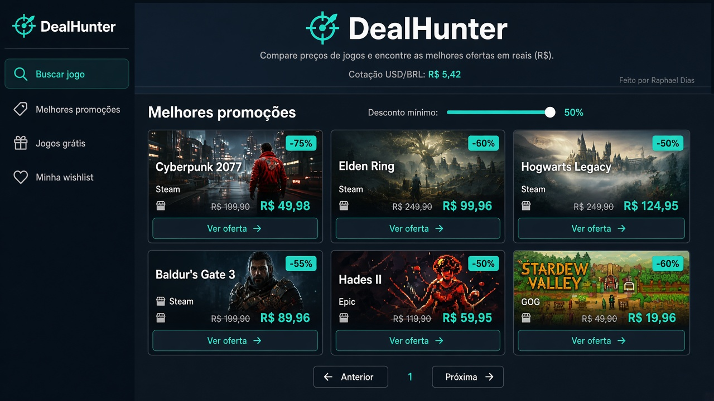
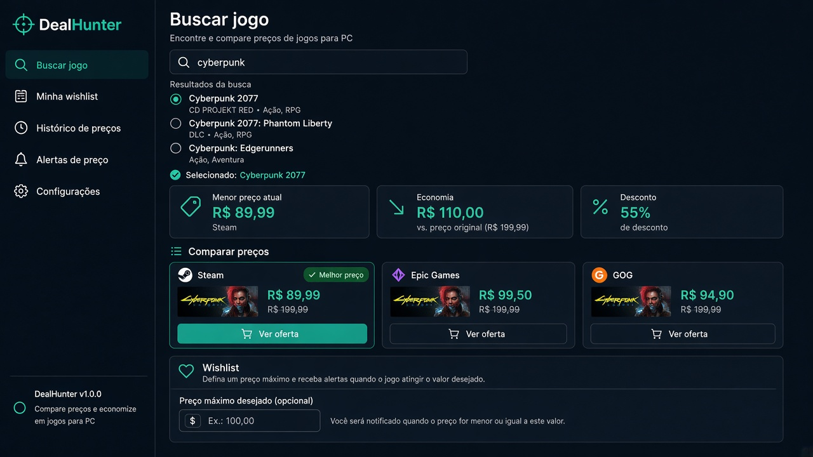
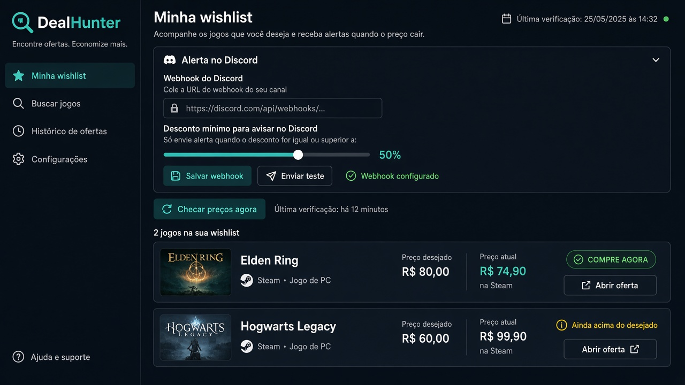
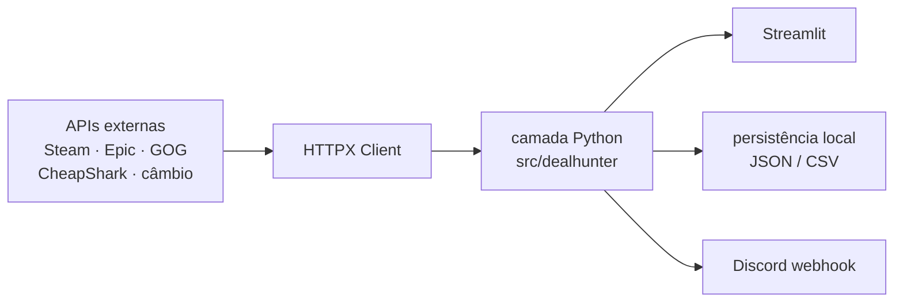

# DealHunter — Multi-store Game Price Tracker

[](https://www.python.org/)
[](https://streamlit.io/)
[](https://www.python-httpx.org/)
[](https://dealhunter.streamlit.app/)

Aplicação web em **Python** e **Streamlit** que integra APIs públicas de lojas e marketplaces de jogos, **normaliza preços em BRL**, compara ofertas, mantém wishlist/histórico e envia alertas via **Discord**. Consome HTTP com **HTTPX**, trata falhas, faz fallback de APIs e persiste dados localmente.

**Demo:** [dealhunter.streamlit.app](https://dealhunter.streamlit.app/) · **Autor:** [Raphael Dias](https://www.raphaeldias.dev.br/)

## Telas

| Principal | Comparação de preços | Wishlist + Discord |
| --- | --- | --- |
|  |  |  |

- **Buscar jogo** — um título, várias lojas, menor preço em reais.
- **Melhores promoções** — desconto mínimo + paginação.
- **Jogos grátis** — giveaway agora, próximos da Epic, F2P.
- **Wishlist** — preço-alvo, histórico e webhook do Discord.

## Arquitetura



`src/dealhunter/` concentra o domínio (busca, cotação, normalização, persistência). `app.py` só renderiza.

## Problemas resolvidos

| Problema | Abordagem |
| --- | --- |
| Várias APIs, schemas diferentes | Cada fonte vira `Oferta` (título, loja, preço, moeda, desconto, link). |
| USD misturado com BRL nativo | Steam/Epic/GOG em BRL; CheapShark em USD × taxa do dia. |
| Cotação fora do ar | Fallback em cadeia: AwesomeAPI → open.er-api → currency-api → PTAX → Frankfurter, com cache de 5 min. |
| Jogo errado / demo no lugar do título | Normalização de título + `mesmo_jogo` (rejeita demo, DLC, soundtrack). |
| Duplicata na lista | Deduplicação por `(título, loja)`. |
| Loja indisponível | Falha isolada: uma fonte cai, as outras seguem. |
| Alertas | Webhook do Discord quando o preço-alvo **ou** o desconto mínimo bate; anti-spam se o preço não melhorou. |

## Decisões técnicas

**`httpx.Client` em vez de um GET solto.** Um cliente só: timeout, `User-Agent`, cookies da Steam (idade) e redirects. Reuso de conexão nas várias lojas da mesma ação do usuário.

**Fallback de câmbio, não uma API só.** AwesomeAPI costuma responder 429/403 em IP de datacenter (Streamlit Cloud). O `get()` não pode engolir isso num `RuntimeError` genérico — senão o fallback nunca roda. 403 falha na hora; 429 vira `HTTPStatusError` depois das tentativas; a próxima fonte assume.

**Normalização entre fontes.** CheapShark fala USD e IDs de loja; Steam HTML/appdetails fala centavos BRL; Epic fala centavos no JSON de promoções; GOG mistura catálogo e ajax. Tudo cai no mesmo `TypedDict` antes da UI.

**Histórico em CSV append-only.** Barato de inspecionar, fácil de plotar no Streamlit, sem banco no demo. Wishlist e webhook em JSON.

## Limite atual da persistência

No Community Cloud, `data/` vive **só na instância**. Redeploy apaga wishlist, histórico e webhook.

Evolução natural:

1. **SQLite local** (`data/dealhunter.sqlite`) — mesma API de persistência, um arquivo, funciona offline e no Cloud enquanto o disco existir.
2. **Supabase / Postgres** — se a wishlist tiver que sobreviver a redeploy e ser compartilhada.

Para portfólio o arquivo local basta; o ponto frágil é o disco efêmero do Cloud, não o modelo de dados.

## Rodar localmente

Python **3.14+** e [uv](https://docs.astral.sh/uv/).

```bash
uv sync
uv run streamlit run app.py
uv run pytest
```

Abre em `http://localhost:8501`.

## Discord

**Minha wishlist → Alerta no Discord:** webhook do canal, desconto mínimo, **Checar preços agora**. A URL fica em `data/config.json` (fora do git).

## Estrutura

```
app.py                 # UI Streamlit
src/dealhunter/        # HTTP, cotação, lojas, normalização, persistência, Discord
tests/                 # conversão BRL, título, deduplicação, fallback de câmbio
data/                  # wishlist, histórico, config (gitignored)
docs/screenshots/      # imagens do README
```

## Aviso

Preços vêm de APIs públicas e podem atrasar ou divergir da loja. Confira no site oficial antes de comprar.
